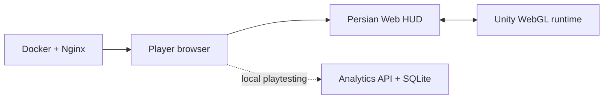

# Star Catcher — Unity WebGL Arcade Game

**[Play the live demo](https://bornapexor.github.io/star-catcher-unity/)** · **[Persian quick start](docs/QUICKSTART.fa.md)** · **[Architecture](docs/ARCHITECTURE.md)**

Star Catcher is a browser arcade game built with **Unity 6**, **C#**, WebGL and Docker. Move the ship, collect stars, avoid meteors and earn the highest score within 60 seconds. The player-facing web experience is in Persian and supports keyboard, pointer and touch controls.

## What is included

- Unity WebGL game loop with scoring, lives, pause/resume, restart and scalable difficulty.
- Responsive Persian HUD with loading and error states.
- Keyboard, touch and pointer controls for desktop and mobile browsers.
- Docker/Nginx deployment for local hosting.
- An optional local analytics API and SQLite dashboard for early playtesting.
- Versioned project settings, WebGL template, C# source and deployment documentation.

## Architecture



The live demo is static GitHub Pages hosting. The analytics API is designed for Docker-based local hosting and will be deployed separately before online player metrics are enabled.

## Run locally

```sh
docker compose up -d --build --wait
```

Open `http://localhost:8088`. The local analytics dashboard is available at `http://localhost:8090/admin`.

## Edit in Unity

1. Install Unity Editor **6000.3.22f1** with the matching **Web Build Support** module.
2. Open this directory through Unity Hub.
3. Open `Assets/Scenes/StarCatcher.unity` and press Play.
4. Choose **Star Catcher → Build Web** to refresh `Web/`.
5. Copy the refreshed Web build to `docs/` before publishing GitHub Pages.

## Controls

| Input | Action |
|---|---|
| `←` / `→` or `A` / `D` | Move the ship |
| Pointer or touch drag | Move the ship |
| `Space` / `Esc` | Pause or resume |

## Project status

**v0.1.0 — published WebGL prototype.** The live build was checked for loading, scoring, collisions, pause/resume, both ending conditions, restart and responsive layout. The next planned release improves visual effects, sound design, device testing and the input architecture.

## Documentation

- [Architecture and browser bridge](docs/ARCHITECTURE.md)
- [Deployment notes](docs/DEPLOYMENT.md)
- [Testing and release checklist](docs/TESTING.md)
- [Roadmap](docs/ROADMAP.md)
- [Change log](CHANGELOG.md)

## Repository notes

`Assets/`, `Packages/`, `ProjectSettings/`, documentation and deployment configuration are versioned. `Library/`, temporary Unity files, local secrets and analytics data remain excluded. A source-code license has not yet been selected.

This project was developed with AI coding assistance. Review, understand and validate the work before representing it in a portfolio.
