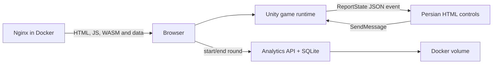

# Architecture

## Current runtime

The game simulation and rendering execute on the player's device. Nginx serves static files; it does not run the Unity Editor or a multiplayer simulation. Scores are per round and disappear on refresh.

The browser creates a random local visitor ID and sends one event at round start plus a result at round end. The analytics API stores the device category/browser, duration and reported score. It derives a masked IP address and a salted SHA-256 hash on the server; it does not keep the raw IP address or full user agent. The dashboard lives at `http://localhost:8090/admin`, is intentionally bound to loopback, and its SQLite file is persisted in the `analytics-data` Docker volume.

For GitHub Pages, analytics is off by default because GitHub Pages cannot host this API. A future deployment can set `window.STAR_CATCHER_ANALYTICS_URL` to the HTTPS address of the dedicated analytics service; the game then uses that service without changing Unity code.

Reported scores are useful for early playtesting but are client supplied. Add server-side score validation before using them for a competitive leaderboard.

## Files and responsibilities

| File | Responsibility |
|---|---|
| `Assets/Scripts/StarGame.cs` | Input, timer, spawn/update, collisions, scoring, sound, game states and Editor-only UI |
| `Assets/Editor/StarBuilder.cs` | Initial scene/material generation and repeatable Web build entry point |
| `Assets/Editor/EditorNumberFormat.cs` | Editor-process numeric-format compatibility for PrefColor parsing on Mono/fa-IR |
| `Assets/Editor/StarValidation.cs` | Repeatable checks for scene references, materials, Web support and editor colors |
| `Assets/Plugins/WebGL/Hud.jslib` | C# → browser JSON state bridge |
| `Assets/WebGLTemplates/StarCatcher/index.html` | Loading/error screen, Persian HUD, touch controls and Unity loader |
| `Assets/Scenes/StarCatcher.unity` | Saved camera, ship, controller and star field |
| `deploy/nginx.conf` | HTTP routes and WebAssembly content type |
| `compose.yaml` | Local server lifecycle, health check and bounded logs |

The builder preserves an existing scene. Scene regeneration is not performed on every build, so subsequent manual scene edits remain intact.

## Game rules

- States: `ready → playing ↔ paused → ended`; restarting creates a new round.
- Each star awards 10 points. Each unshielded meteor collision removes one of three lives.
- A collision grants 1.5 seconds of protection against repeated damage.
- The round ends at zero lives or 60 elapsed game seconds. Pausing stops the clock.
- Losing browser focus pauses. Left/Right and A/D control movement; Space/Escape toggle pause.
- Touch controls send normalized horizontal targets or a held direction.

## Browser contract

Target GameObject name: `Game`. Methods: `StartRound`, `TogglePause`, `PauseGame`, `ReleasePointer`, `SetDirection(string)` in [-1,1], `SetTarget(string)` in [0,1], and `SetSound(string)` with `1`/`0`.

Unity emits `unity-state` events with `{ phase, score, lives, time }`. The template updates text through `textContent`; it does not accept untrusted HTML. This bridge is local to the loaded page and is not an authenticated API.

## Deliberate constraints

One controller keeps this prototype small. Before adding multiple levels or progression, extract a pure C# round-state model, input adapter, spawner, presentation layer, and ScriptableObject balance settings. Add automated tests around the extracted model. Pool objects when profiling shows allocations are material. A future leaderboard requires a separate backend and server-side validation; client scores cannot be trusted.

Keyboard input currently uses Unity's legacy Input Manager (`activeInputHandler: 0`). Unity reports a deprecation warning. Move to the Input System package and retest keyboard/browser focus behavior in v0.2.0. This limitation is explicit; the project does not claim that migration is already complete.

The initial Web export disables compression to avoid compressed-file header mismatches. After the first verified release, measure size and add compression plus the corresponding server headers as a separate change. Do not claim all devices are supported; record actual browser/device checks.
